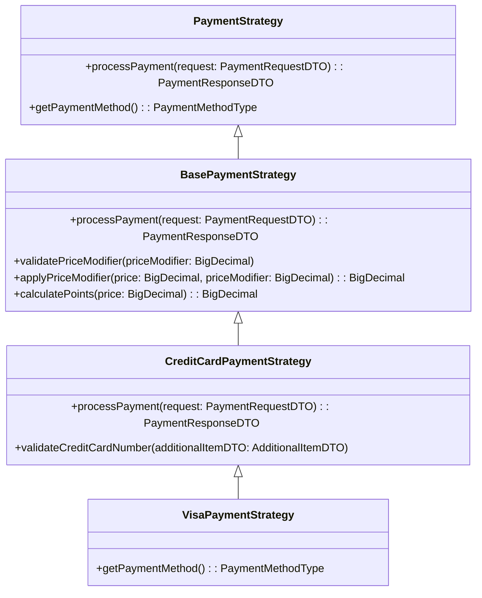

# Backend Engineer Payment System

This project implements a **POS-integrated e-commerce platform** with multiple payment methods. The platform supports various payment methods, calculates price modifiers, rewards points, and manages additional information (e.g., credit card details). It uses the **Strategy Pattern** to handle different payment methods in a modular and extensible way.

### Prerequisites:
- Java 17
- PostgreSQL
- Maven (for building the project)
- Git

## Key Features
- Handles various payment methods like **CASH**, **VISA**, **Mastercard**, **LINE_PAY**, and more.
- **Price Modifiers** and **Points Calculation** based on the payment method selected.
- Easy integration with e-commerce stores via REST APIs.
- Sales tracking by date and hour with points given to customers.
- Error handling for invalid inputs and responses.
- Scalable architecture and multi-threading support.
- Unit and integration tests for reliable operation.

## Payment Method Strategies
The system employs the **Strategy Pattern** to process payments with different payment methods. Each payment method is handled by a dedicated strategy class, which includes:
- Price modification logic.
- Point calculation logic.
- Validation and handling of specific payment details (e.g., credit card last digits).

### Payment Strategy Flow
- Each payment method (e.g., VISA, Mastercard) extends a base strategy (`BasePaymentStrategy`).
- Specific payment strategies implement their own logic for modifying prices and calculating points.
- A **PaymentStrategyFactory** dynamically selects the correct strategy based on the payment method.

### Diagram



## API Endpoints

### `POST /payment`
Executes the payment and returns the final price and points.

#### Request:
```json
{
  "customerId": "12345",
  "price": "100.00",
  "priceModifier": 0.95,
  "paymentMethod": "VISA",
  "datetime": "2022-09-01T00:00:00Z",
  "additionalItem": {
    "last4": "1234"
  }
}
```

#### Response:
```json
{
  "finalPrice": "95.00",
  "points": 5
}
```

### `POST /sales`
Fetches sales data within a given date range.

#### Request:
```json
{
  "startDateTime": "2022-09-01T00:00:00Z",
  "endDateTime": "2022-09-01T23:59:59Z"
}
```

#### Response:
```json
{
  "sales": [
    {
      "datetime": "2022-09-01T00:00:00Z",
      "sales": "1000.00",
      "points": 10
    },
    {
      "datetime": "2022-09-01T01:00:00Z",
      "sales": "2000.00",
      "points": 20
    }
  ]
}
```

## How to Run

1. Clone the repository.
2. Set up a PostgreSQL database.
3. Configure application properties (`application.properties`).
4. Build the project using Maven or Gradle.
5. Run the application (`java -jar` or using an IDE).

## Testing
The system is tested using unit tests and integration tests to ensure correctness and scalability.

---

### Design Patterns Used:
- **Strategy Pattern** for payment method handling.

